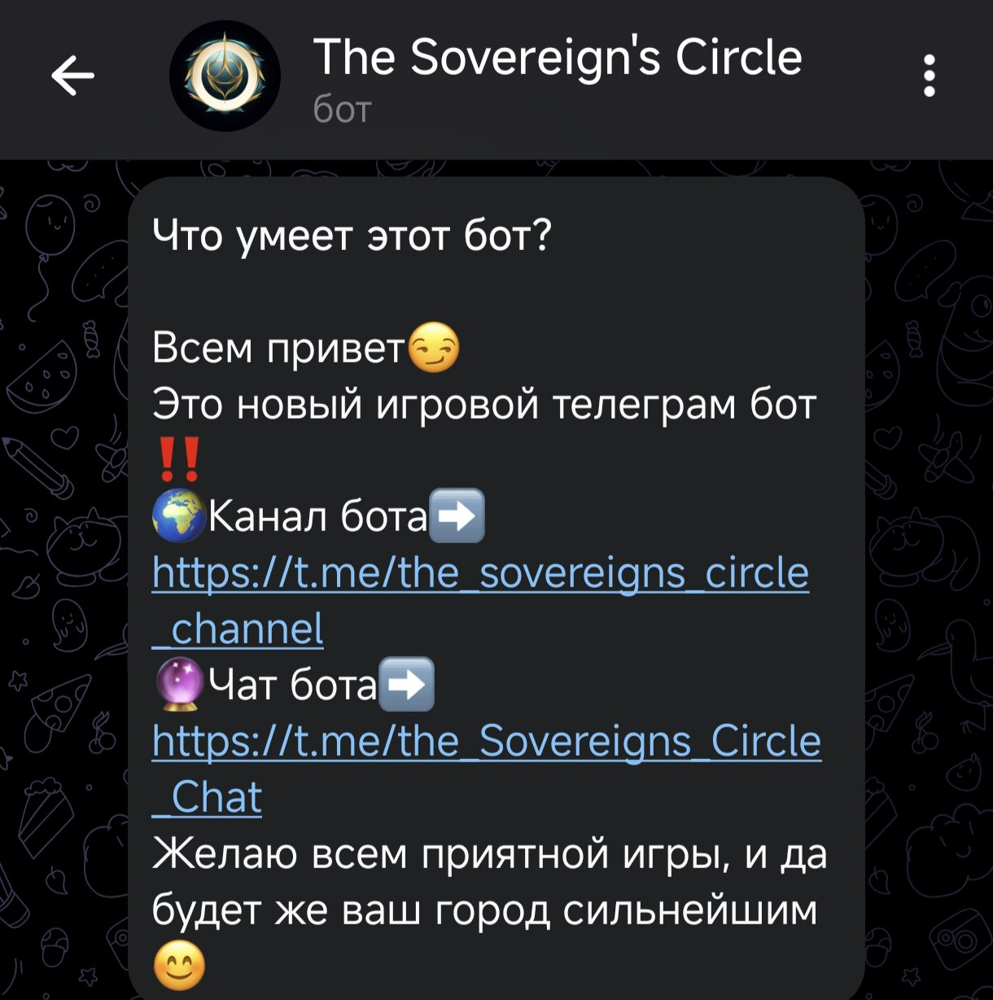
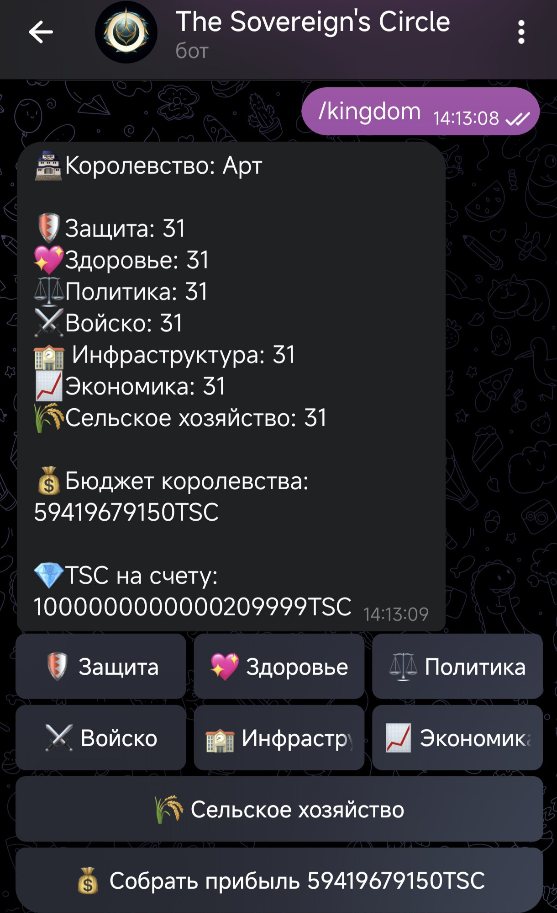
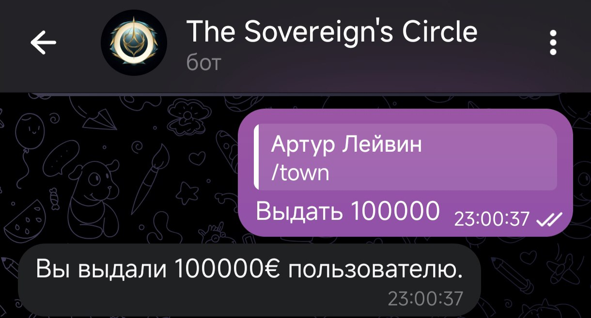

# Бот для игры "The Sovereign`s Circle"
Коротко: игра предназначенная для игроков желающих создать собственное королевство, которое они смогут развивать и усиливать, возможность соревноваться против других людей в битве самого сильного королевства!

**Технологии:** Python, Aiogram, SQLite

## Что делает
- Зарегистрировать королевство (создать)
- Получить рейтинг сильнейших
- Улучшать королевство
- Играть в аркадные игры - на игровые деньги (казино, слоты, блэк-джек, кости, дуэли).
- Получать деньги по промокоду
- Скидывать деньги другим игрокам

## Как посмотреть
- Файлы в репозитории.
- 
- 
- 
- 
- 

🔗 Исходники: https://github.com/ArtL777<ArtL777>/<repo>
