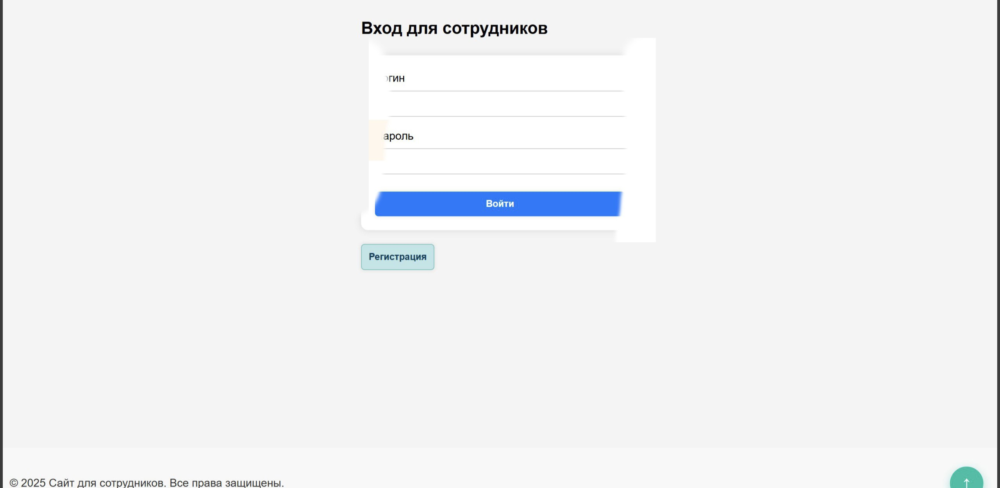
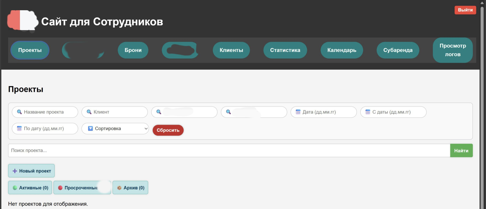
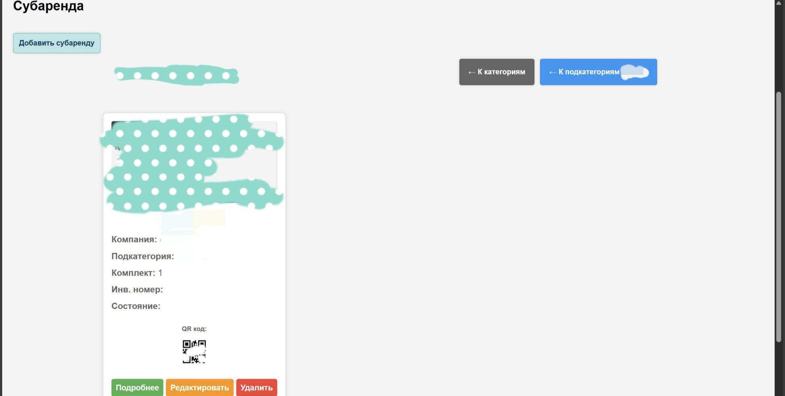
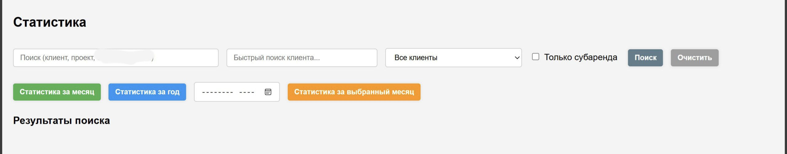
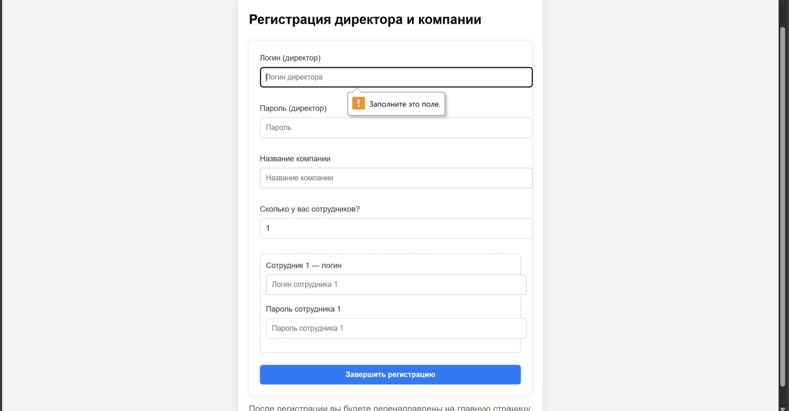
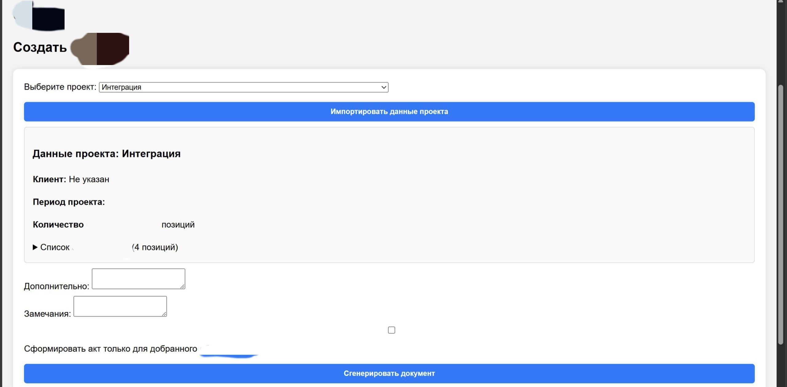
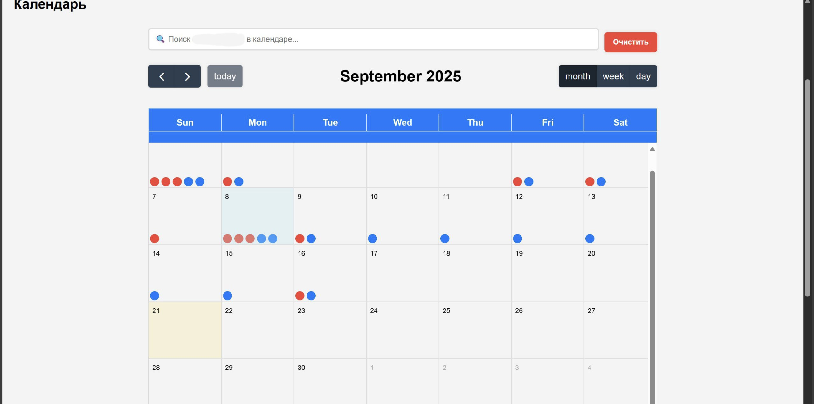
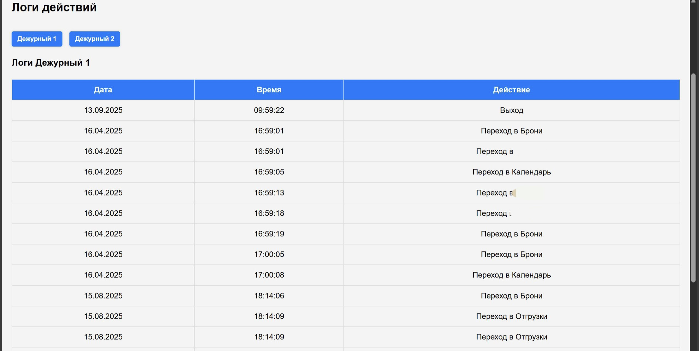
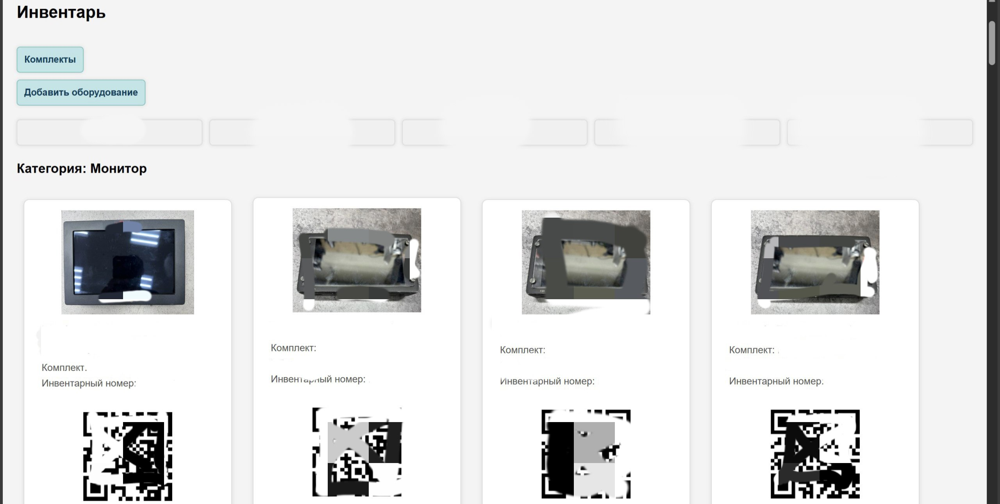
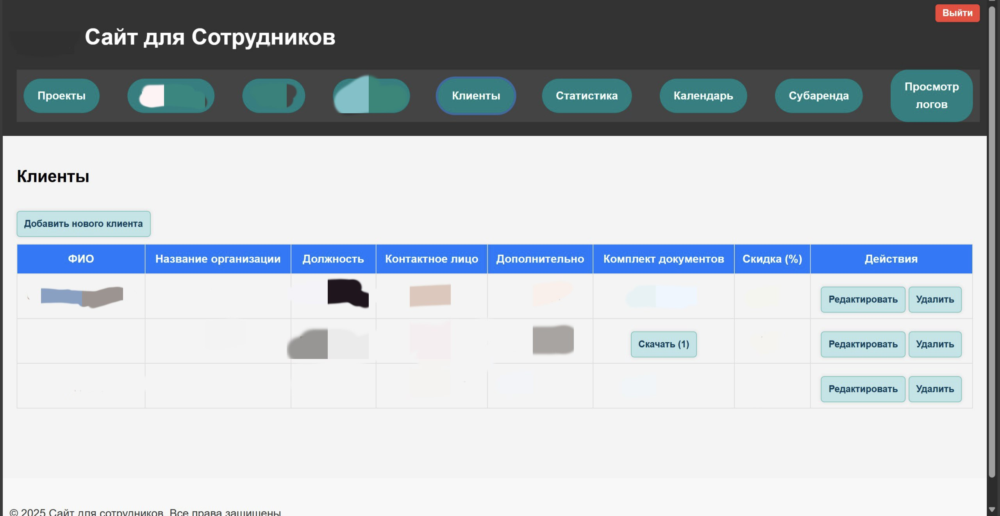

# Сайт для компании
Коротко: проект (разработка которого продолжается) для учёта, сохранения и анализа данных: по движению проектов и броней, субаренды, клиентов, инвентаря

**Технологии:** JS, Node.js + Express, HTML, CSS, SQLite

## Что делает
- Регистрация аккаунта директора
- Регистрация аккаунтов сотрудников
- Формирование проектов
- Интеграция проекта в брони по субаренде
- Создание инвентарных карточек
- Сканер ШТРИХ/QR - кодов
- Формирование клиента с документами (подтверждения)
- Формирование акта (word-документа) по данным
- Статистика (анализ данных)
- Календарь с планированием, отметкой проектов и броней, гиперссылка для быстрого поиска
- Админ панель
- И множество других функций

## Как посмотреть
- Файлы в репозитории.
- 
- 
- 
- 
- 
- 
- 
- 
- 
- 

## Не предоставляю код (частный проект)

🔗 Исходники: https://github.com/ArtL777<ArtL777>/<repo>
