# CRM-система для автоматизации бизнес-процессов компании

Коммерческий проект. CRM-система, разработанная с нуля для автоматизации внутренних процессов компании: управление проектами, субарендой, клиентами, складом и аналитикой.

⚠ Код проекта не публикуется, так как является частной собственностью компании!

## 📌 Описание проекта

Система используется сотрудниками компании в ежедневной работе и обеспечивает:

- Централизованное хранение данных
- Контроль загрузки оборудования и проектов
- Управление субарендой
- Складской учёт
- Аналитику и формирование отчётности
- Контроль прав доступа сотрудников

Проект разработан и внедрён в production-среду.

## 🏗 Архитектура

Backend:
- Node.js + Express
- REST API
- Модульная архитектура
- Централизованная обработка ошибок
- Логирование действий пользователей

Дополнительные сервисы:
- Python (asyncio) для фоновой обработки данных
- Генерация отчётов
- Интеграция с внешними API

База данных:
- PostgreSQL (production)
- SQLite (dev)
- Индексы и оптимизация SQL-запросов

Контейнеризация:
- Docker
- Разделение dev / production окружений

## 🚀 Основной функционал

### Управление проектами
- Создание и редактирование проектов
- Контроль статусов
- Связь с бронированием и субарендой

### Работа с клиентами
- Формирование клиентских карточек
- История взаимодействия
- Генерация документов

### Складской учёт
- Инвентарные карточки
- Контроль занятости оборудования
- Предотвращение конфликтов бронирования

### Документооборот
- Генерация Word-документов на основе данных CRM
- Автоматическое заполнение шаблонов

### Аналитика
- Статистика по проектам
- Анализ загрузки
- Агрегированные данные

### Дополнительные возможности
- Сканирование QR / штрих-кодов
- Календарь с планированием и быстрым поиском
- Административная панель
- Управление сотрудниками и ролями
- Профили пользователей
- Смена логотипа компании
- Логирование действий
- Управление доступами

## 🔒 Причина отсутствия исходного кода

Проект является коммерческой разработкой и интеллектуальной собственностью компании-заказчика.  
По этой причине исходный код не публикуется в открытом доступе.

В репозитории представлены:
- Описание архитектуры
- Стек технологий
- Скриншоты интерфейса

## 🖼 Скриншоты интерфейса

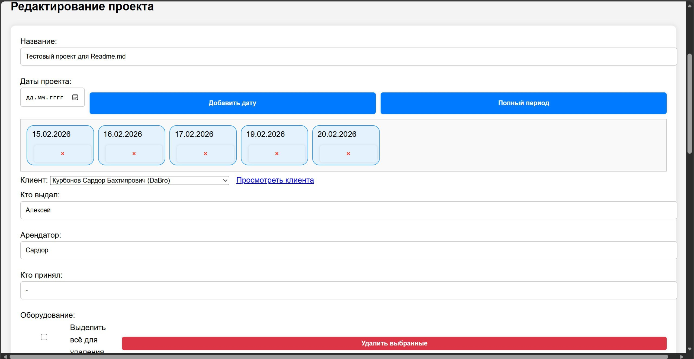
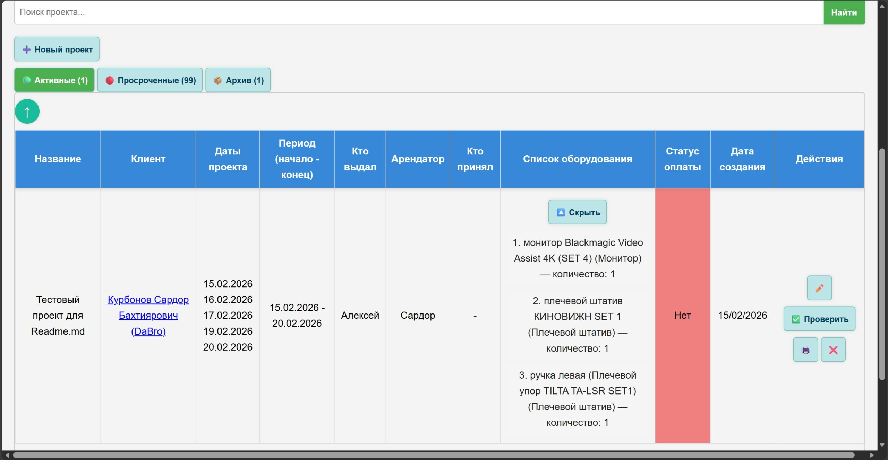
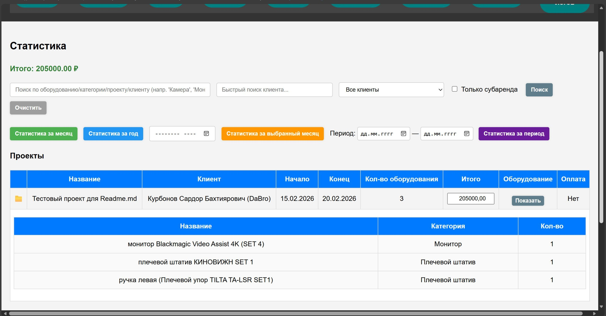
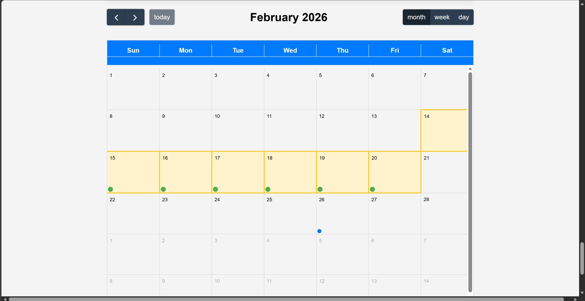
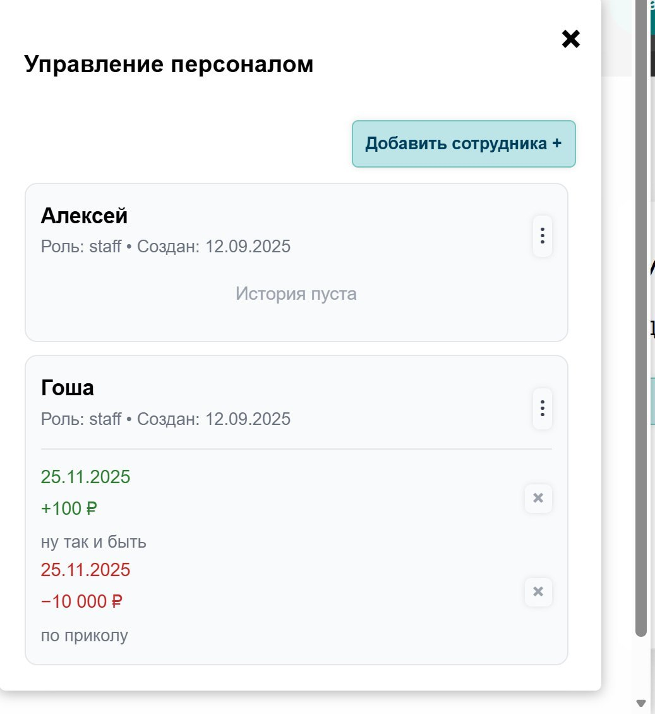
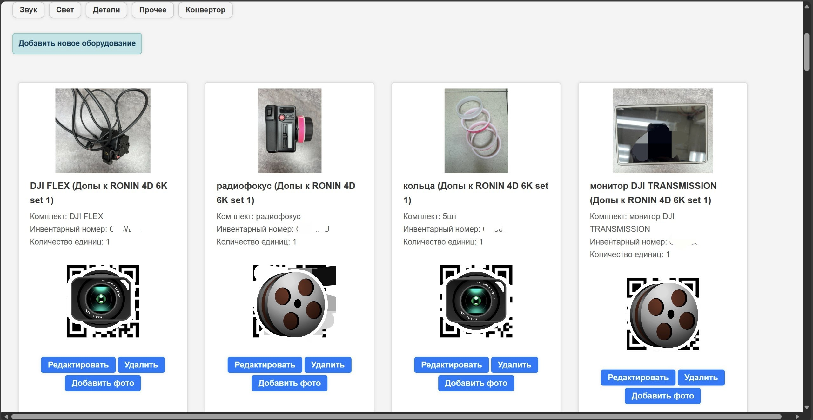
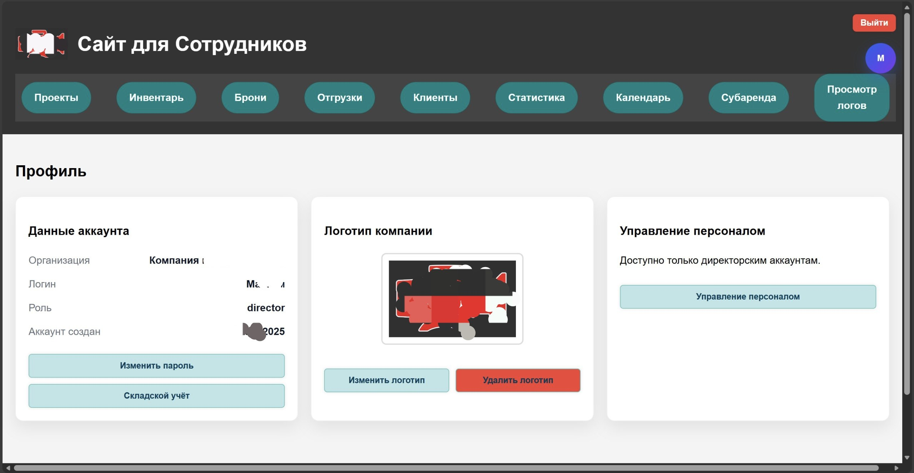
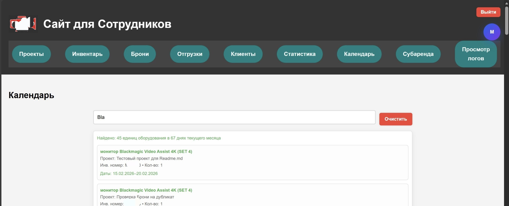
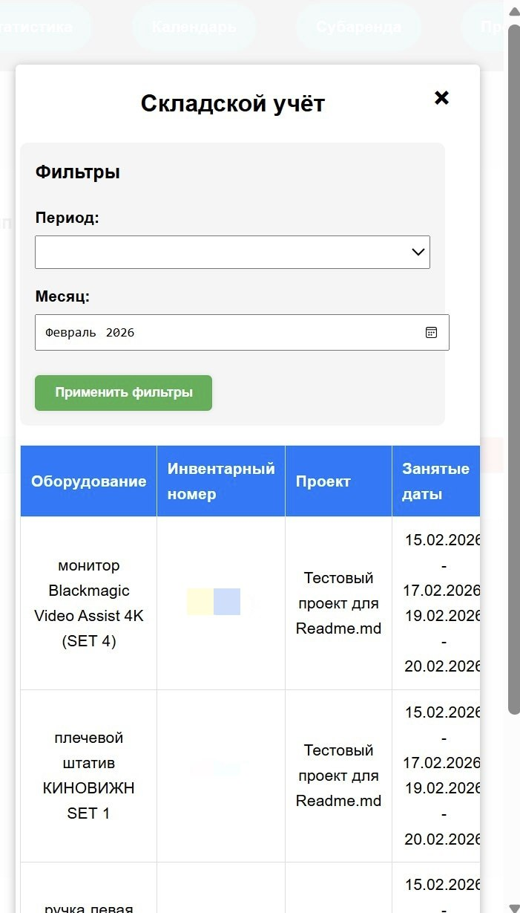
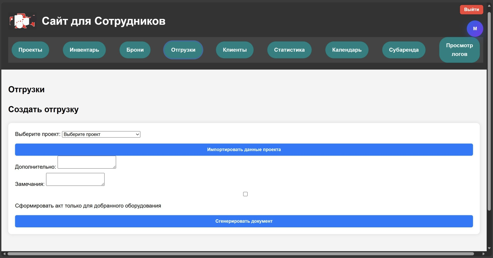
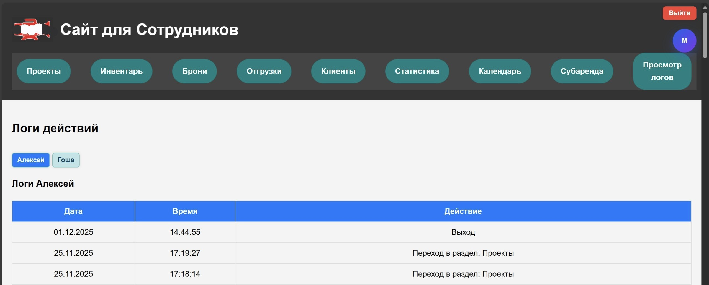
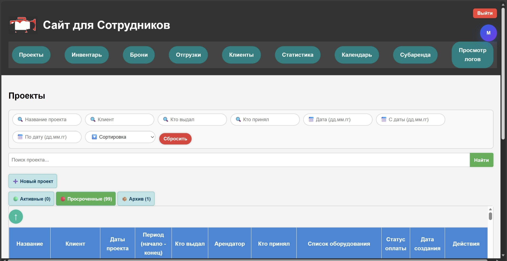
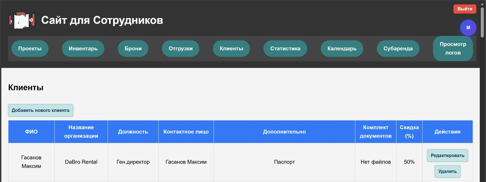
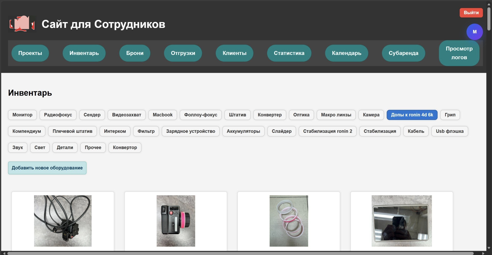

## 👨‍💻 Автор

Сардор Курбонов  
Backend / Fullstack Developer  

GitHub: https://github.com/ArtL777
