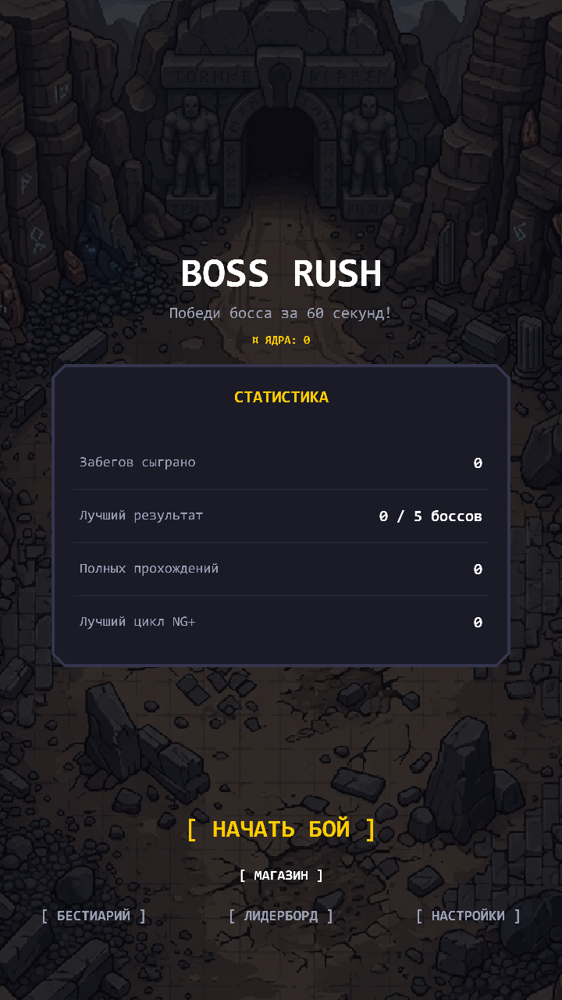
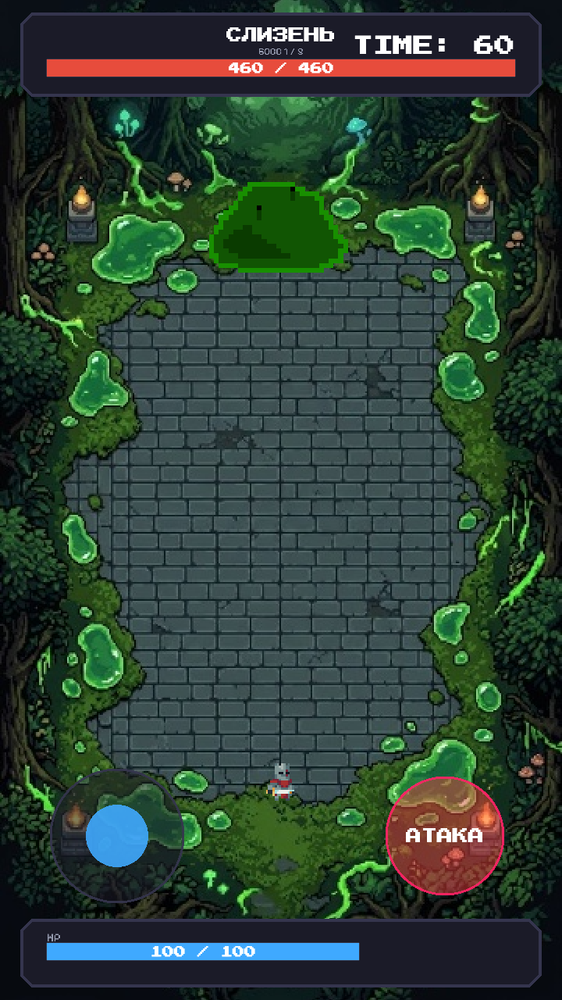

# ⚔️ Boss Rush — «Босс на 60 секунд»

Аркадный boss-rush для веб-платформы **Яндекс Игры**: побеждай 5 уникальных боссов, каждого — за 60 секунд, прокачивай постоянные улучшения между забегами и открывай реликвии для нового прохождения (NG+).

**Технологии:** Phaser 3 (WebGL), Vite, Vanilla JS (ES-модули), Yandex Games SDK v2

## Что делает

- **5 боссов с уникальными паттернами атак**: Слизень, Голем, Дракон, Космический червь, Робот — каждый со своим набором телеграфируемых атак и опасных зон на арене
- **Ран-прогрессия внутри забега**: временные улучшения, которые сгорают при поражении (roguelite-цикл)
- **Постоянная мета-прогрессия**: валюта («ядра»), прокачка статов до 5 тиров и **реликвии** (например, «Второе дыхание», «Вампиризм», «Берсерк») — сохраняются между забегами
- **New Game+**: полное прохождение всех боссов открывает следующий цикл сложности
- **Система достижений**: первая кровь, прохождение без урона, спидран, полная зачистка, коллекционирование и др.
- **Бестиарий и лидерборд** с локальной историей забегов
- Адаптивный UI: мобильные touch-контролы (виртуальный джойстик + кнопка атаки) и полноценная раскладка для десктопа с боковыми HUD-панелями
- Пиксельный визуальный стиль на самохостящихся шрифтах (Press Start 2P + Pixelify Sans)

## Интеграция с Yandex Games SDK

Игра полностью готова к публикации на Яндекс Игры:

- Автоопределение языка платформы (`environment.i18n.lang`)
- `LoadingAPI.ready()` и `GameplayAPI.start/stop` для аналитики вовлечённости платформы
- Полноэкранная межстраничная реклама с паузой аудио на время показа
- Лидерборд (`leaderboards.setScore/getEntries`)
- Облачные сохранения (`player.setData/getData`) с двусторонним слиянием прогресса — облако никогда не затирает более свежий локальный прогресс

Все вызовы SDK — best-effort: `window.YaGames` может отсутствовать (локальная разработка, другой хостинг), и тогда каждая фича превращается в no-op без ошибок — игра одинаково работает и на Яндекс Играх, и где угодно ещё.

## Архитектура

```
boss-rush/
├── index.html              ← точка входа, шрифты, адаптивная HTML-разметка HUD
├── src/
│   ├── main.js              ← инициализация SDK, старт Phaser
│   ├── config/               ← константы, конфиг Phaser
│   ├── scenes/                ← Menu, Game, Result, Meta
│   ├── entities/               ← Player, базовый класс Boss
│   ├── bosses/                  ← 5 боссов с уникальными паттернами атак
│   ├── managers/                 ← бой, прогрессия, статистика, звук, Yandex SDK
│   └── ui/                        ← HUD, модалки, пиксельные компоненты
└── public/assets/                  ← спрайты, шрифты
```

## Запуск локально

```bash
npm install
npm run dev
```

Открыть адрес из вывода Vite (обычно `http://localhost:5173`). Сборка продакшен-версии:

```bash
npm run build
```

## Управление

- **Клавиатура:** WASD / стрелки — движение, ЛКМ или пробел — атака
- **Тач-устройства:** виртуальный джойстик слева, кнопка атаки справа

## Скриншоты




🔗 Исходники: https://github.com/ArtL777/portfolio/tree/main/boss-rush
