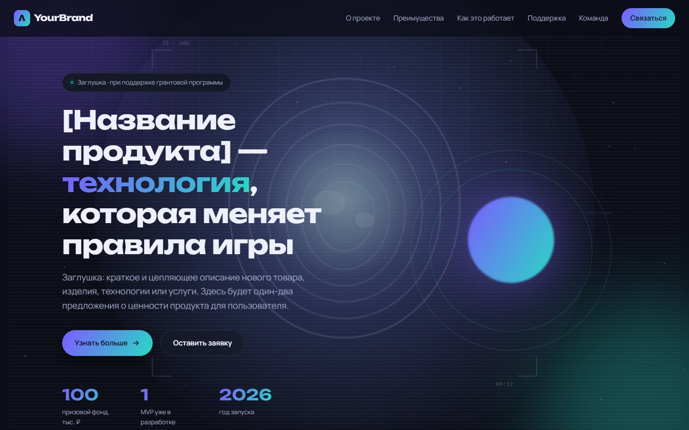
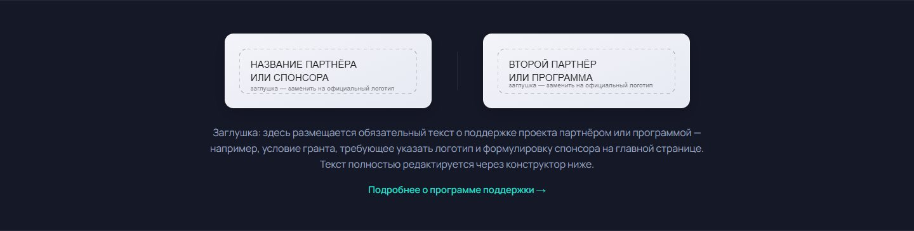
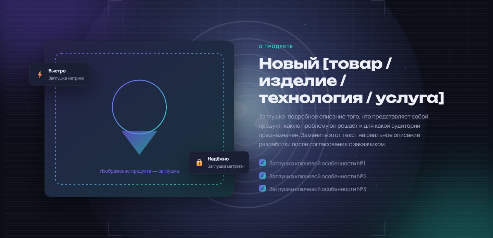
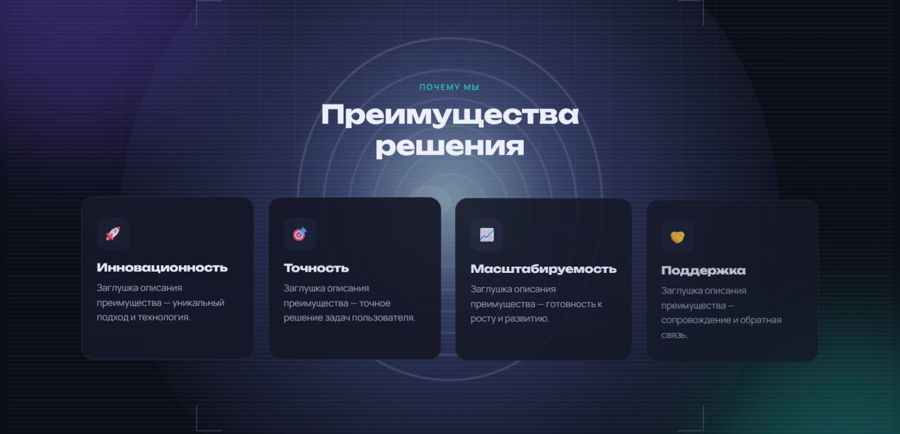
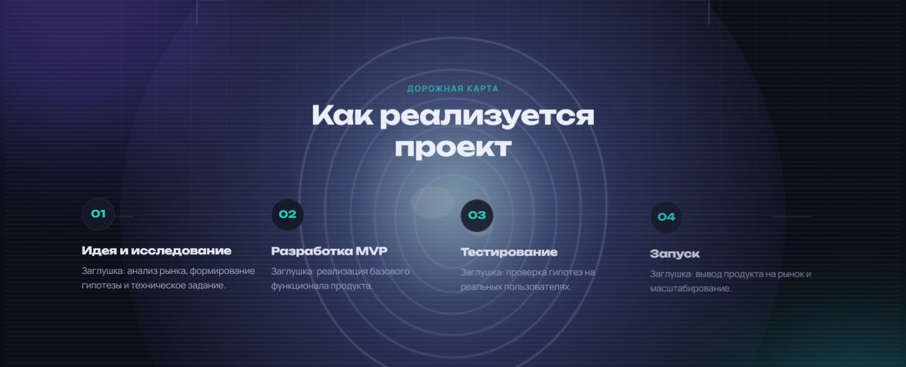
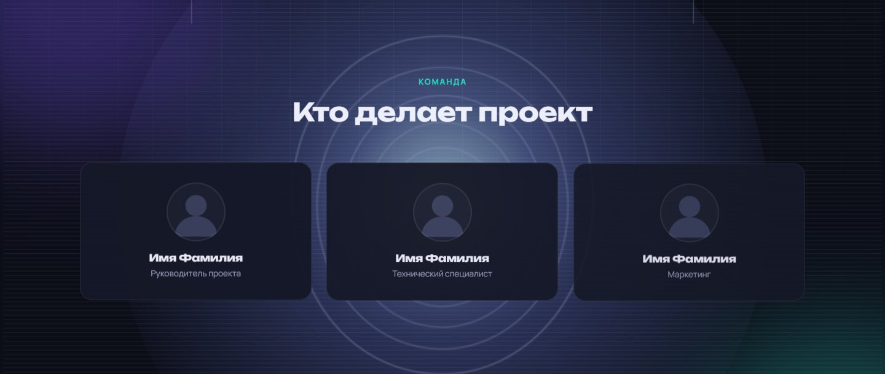
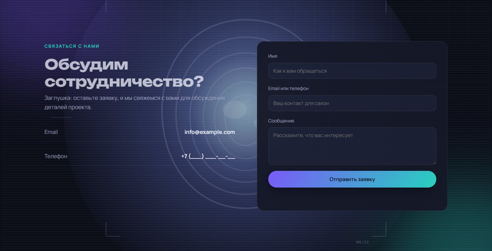
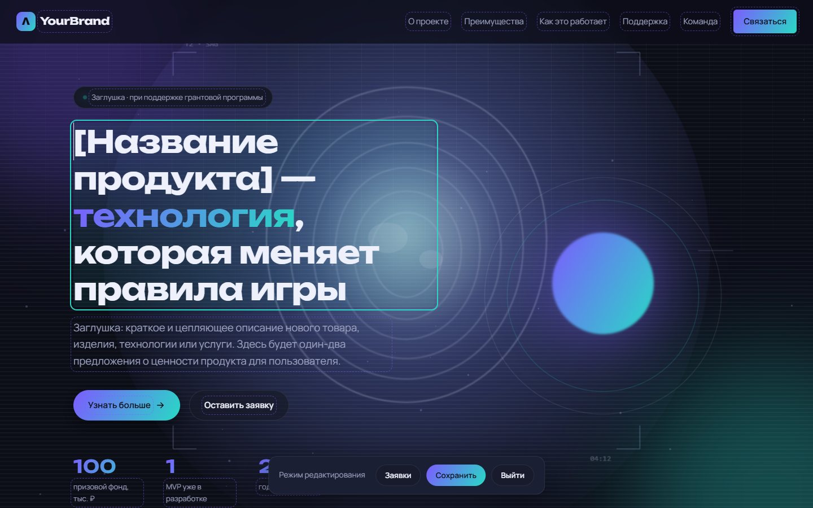
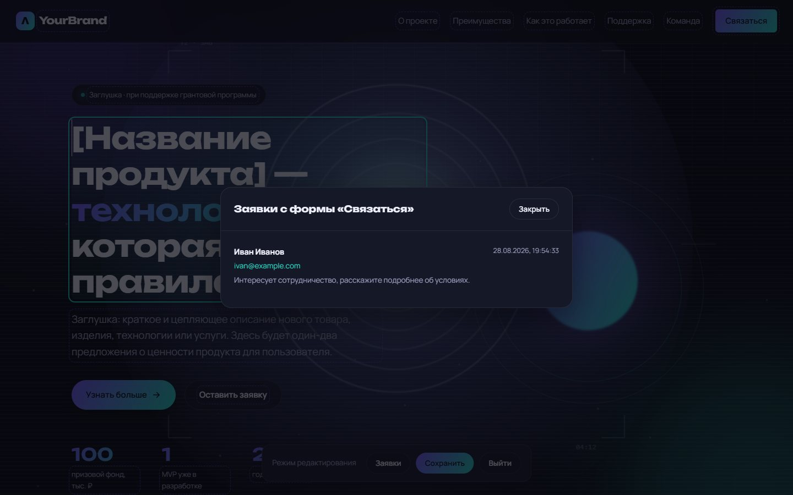

# Startup Landing + CMS

Адаптивный анимированный лендинг со встроенной мини-CMS: заказчик редактирует
любой текст и изображение прямо на странице, без обращения к разработчику —
правки сохраняются в базе данных и подгружаются при следующем визите.

> Реальный клиентский проект. Исходный код закрыт по требованию заказчика —
> это его интеллектуальная собственность, и разглашение противоречит условиям
> программы, в рамках которой проект финансировался. Ниже — только описание
> и скриншоты интерфейса.

## Скриншоты

**Главный экран**

**Блок партнёра/спонсора** — логотипы и текст полностью редактируются

**О продукте**

**Преимущества**

**Дорожная карта**

**Команда**

**Форма обратной связи**

**Режим редактирования** — пунктирная рамка вокруг активного текстового блока и
плавающая панель конструктора внизу

**Панель заявок** внутри конструктора — заявки с формы без захода в БД

## Зачем это

Клиенту нужен был не просто лендинг, а сайт, который он сможет сам
поддерживать: менять тексты, подставлять фото, отслеживать заявки — без
повторных обращений к разработчику. Дизайн должен был выглядеть на уровне
дорогих агентских лендингов, а не шаблона с конструктора.

## Ключевые фичи

- **Визуальный конструктор контента** — в режиме редактирования любой текстовый
  блок кликабелен и сохраняется в базу данных, любое изображение меняется
  простой загрузкой файла.
- **Скрытый вход в конструктор** — без публичной кнопки «Войти как админ»:
  пароль редактора вводится в обычное поле «Имя» формы обратной связи и
  включается по нажатию «Отправить». Обычная заявка при этом продолжает
  работать штатно.
- **Приём и просмотр заявок** — обращения с формы доступны в отдельной панели
  внутри режима редактирования, без захода в базу данных напрямую.
- **Настраиваемый блок партнёра/спонсора** — логотипы и обязательный текст
  соответствия требованиям грантовой программы вынесены в редактируемые поля,
  а не зашиты намертво в вёрстку.
- **Адаптивная подложка логотипов** — при загрузке логотипа партнёра сайт сам
  анализирует его яркость и решает, тёмная нужна подложка или светлая, чтобы
  светлый логотип не «терялся» на своей карточке.
- **Загрузка изображений** — с проверкой типа файла, лимитом размера и защитой
  от коллизий имён.

## Что было решено технически

- Устранено подтормаживание при скролле, вызванное лишними пересчётами
  раскладки страницы на каждом кадре.
- Оптимизирован рендер длинной страницы: секции вне экрана не тратят ресурсы
  браузера, пока не понадобятся.
- Фоновая анимация останавливается сама, когда её не видно или вкладка
  свёрнута — не жжёт батарею и CPU впустую.
- Экранирование пользовательского ввода в панели заявок — защита от
  XSS-инъекций через имя/сообщение с формы.
- Найден и исправлен неочевидный визуальный CSS-баг на кнопках с очень
  большим скруглением (появлялся едва заметный шов другого цвета по краю).

## Стек

Node.js · Express · PostgreSQL · HTML5 · CSS3 · Vanilla JS · Multer

Без сборщиков и фреймворков на фронтенде — весь интерактив на чистом JS.

## Лицензия

Исходный код закрыт — это интеллектуальная собственность заказчика. Здесь
представлены только описание и скриншоты для демонстрации проделанной работы.
