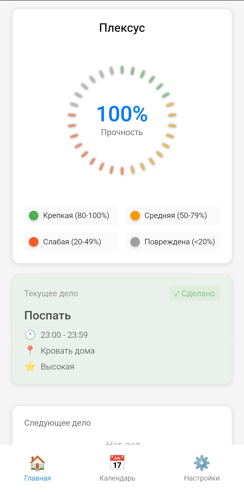
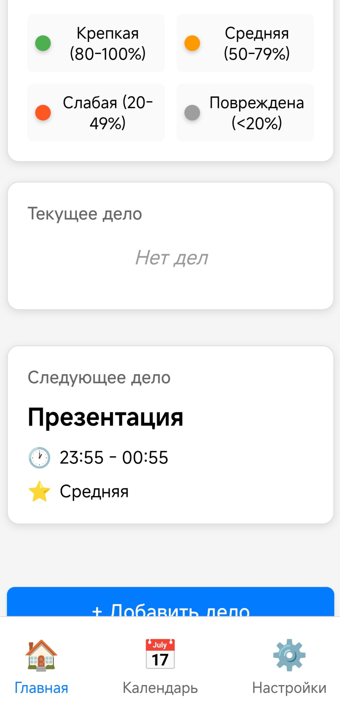
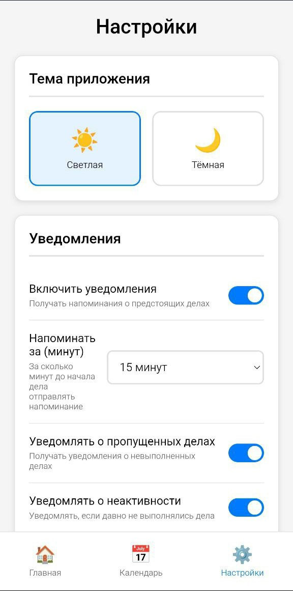
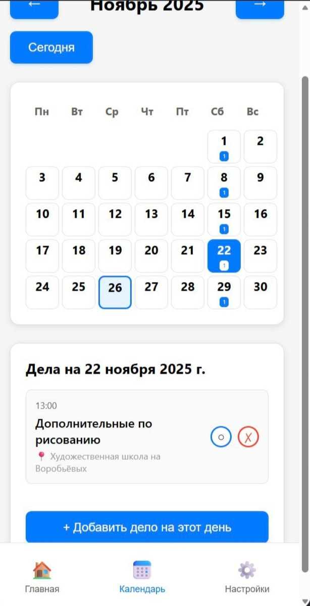

# Крепкая Нить

Мини-приложение с чат-ботом для мессенджера MAX для управления делами и повышения личной эффективности.

## Описание

Приложение построено на концепции "крепкой нити" - визуализации продуктивности. Каждое выполненное дело добавляет ниточку, из которых сплетается крепкая нить. Пропущенные дела ослабляют и повреждают нить.

## Функциональность

### Мини-приложение

- **Главная страница**: Визуализация крепкой нити, текущее и следующее дело
- **Календарь**: Отображение месяцев с делами
- **Настройки**: Изменение темы приложения и настройка уведомлений

### Типы дел

1. **Одноразовые дела**: Дела на конкретную дату и время
2. **Повторяющиеся дела**: Дела с расписанием на неделю (цикл до 4 недель)

### Поля дела

- Название (обязательно)
- Время начала (обязательно)
- Время окончания (опционально)
- Локация (опционально)
- Уровень важности (опционально)
- Комментарий (опционально)

### Чат-бот

Чат-бот отправляет:
- Напоминания о предстоящих делах (настраиваемое время до начала)
- Уведомления о пропущенных делах
- Уведомления о неактивности

## Хранение данных

Приложение использует MAX Bridge для хранения данных пользователей. Данные автоматически синхронизируются между устройствами пользователя через MAX Bridge API.

## Развертывание

Приложение автоматически развертывается на GitHub Pages при пуше в ветку `master` через GitHub Actions.

## Используемые технологии

- React
- MAX-UI
- MAX-Bot-API
- MAX Bridge
- Webpack

## Как посмотреть
- Файлы в репозитории.
- 
- 
- 
- 

🔗 Исходники: https://github.com/ArtL777<ArtL777>/<repo>